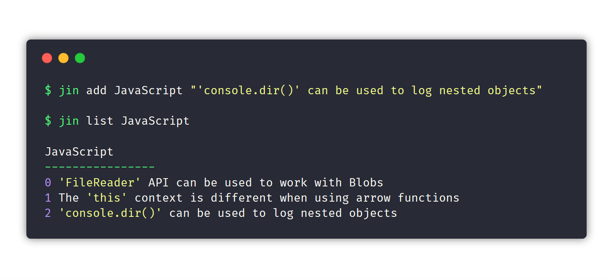

<h1 align="center">jin</h1>

<p align="center"><em>A CLI app for taking simple notes without ever leaving the terminal.</em></p>

## Overview

Jin allows you to take and organize simple notes without ever leaving the command line. Capture ideas, track tasks, and reference code snippets with straightforward and intuitive commands.

## Installation

```bash
$ npm install --global jin-app
```

## Usage

### Commands

* [`add`](#add-notes)
* [`list`](#list-notes)
* [`remove`](#remove-notes)
* [`backup`](#backup)
* [`export`](#export)
* [`help`](#help)

### Add Notes

```bash
$ jin add [notebook] <note>
# jin a [notebook] <note>
```

```bash
$ jin add [notebook]
# jin a [notebook]
```

#### Example

```bash
$ jin add nodejs "Use 'util.promisify()' to promisify a callback-style function."

Added "Use 'util.promisify()' to promisify a callback-style function." to "nodejs".
```

### List Notes

```bash
$ jin list [notebook]
# jin ls [notebook]
```

```bash
$ jin list
# jin ls
```

#### Example

```bash
$ jin list nodejs

nodejs
----------------
0 Use 'os.homedir()' to access the home directory
1 Use 'util.promisify()' to promisify a callback-style function.
```

### Edit Notes

WIP

### Remove Notes

```bash
$ jin remove [notebook] <index>
# jin rm [notebook] <index>
```

```bash
$ jin remove [notebook]
# jin rm [notebook]
```

#### Example

```bash
$ jin remove nodejs 0

Removed note at index 0 from nodejs notebook.
```

```bash
$ jin rm --force nodejs

Removed nodejs notebook.
```

### Backup

WIP

### Export

WIP

### Help

## Related Projects

## Licence

MIT &copy; [Christopher Murphy](https://github.com/splode)
